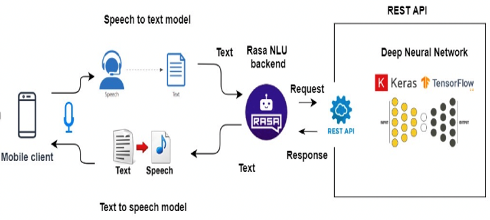
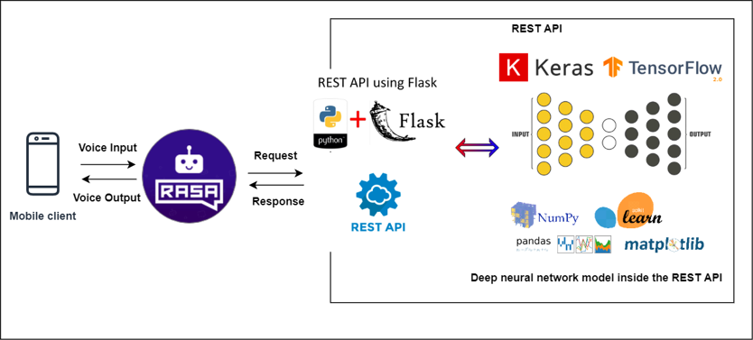

# 2020-016

# Group details

### IT17106184 - Weerathunga W.A.H.
### IT17106016 - Lokugamage G.N.
### IT17044400 - Hariharan V.
### IT17115308 - Yahampath A.D.N.H.

# Project
Voice Based E-Channeling System and Domain Specific Voice Based AI Training Framework

# Project Description
E-Channeling has become extremely popular and useful with the current busy life style in our society. The facility to channel your doctor in the comfort of your home is priceless. Currently, in Sri Lanka there are number of different E-Channeling services provided by leading tele-communication service providers and hospitals. Though these services have increased the productivity and efficiency of channeling. Customers face difficulty of filling a lot of details while using mobile applications or e-channeling websites or while giving a lot of details to the call operator via a phone call for channeling purposes. Some elderly people are reluctant to use the mobile applications, because they have to fill a lot of details and they have to travel between multiple screens in the mobile application. We understood the lack of usability in all the above scenarios. So, we present a complete voice-based solution. In here, the customer can state their request using the voice feature and the application will give a feedback using voice. The whole process will be done through voice commands, while displaying the relevant details to the user on the mobile screen. Since speech is the most common mode of communication between humans, the voice recognition based mobile application will overcome the barriers of literacy and will serve both literate and illiterate parties as our application is based on the spoken utterances of the user.

# Research Question
E-Channeling is a major part in the health care sector which is used by large number of people regardless of their age to channel doctors. Currently this is done using the mobile app for e-channeling , calling the mobile operator or by using the website. Lot of leading telecommunication brands with collaboration of hospitals and government provide this facility. Though they give this service to a certain level almost all of the users are not satisfied with the procedure. The online application is too long and it take time to fill and same goes with the app because it also has multiple screens to navigate to complete the channeling procedure. In Sri Lanka lot of elderly people are not very much familiar with the technology also they are not used to fill digital forms. And for above reasons they are not using the online methods to channel doctors. Some people travel to the hospital to get a channel appointment one day and go to the appointment date on another. Another problem that arise in these scenarios are a lot of people do not have a clear idea about which doctor to channel for their sickness. In the current e-channeling domain there are lot of problems like which are mentioned above.

# Main Objective
To implement an Android Mobile application that has end to end voice assistant capability 
in the E-Channeling sector. And create a domain specific voice assistant that can be customized
to any domain.

# Research Objectives

- **Recognize the users utterances which is specific to e-channeling**
- **Creating RASA backend to select most accurate APIs and do the backend tasks**
- **Create a REST API with Neural Network Models to give the doctor specialization according to the symptoms and give health instructions in emergencies**
- **Give the response back to the user in more human like voice**

# Summary of Individual Components - IT17106016 - Lokugamage G.N.

### REST API with Deep Neural Network Models

E-Channeling services have many problems, among these problems, the most critical one is when people do not know the specialist to make an appointment. Specialists are found in all fields of medicine. Before consulting a specialist, firstly, most of the people used to consult a local doctor. Sometimes, they also ask for a recommendation from a trusted source such as friends and family. Later, they must pay the specialist’s fee and they will not be able to claim reimbursement from Medicare always. If the first opinion was wrong, then they must seek a second opinion. At that time, they must pay again, and they must do it soon as possible. If they are delayed, the health conditions can dropdown. Besides, doctors are not available every day. With the current requirement, I supposed a doctor specialization recommendation system.
Doctor specialization recommendation system has emerged aimed at recommending the right doctor specialization in accordance with the patient’s symptoms. The development of this kind of system that uses deep neural networks will provide a very accurate prediction. This will be solving most of the problems faced by the people while making appointments to channel a doctor. This deals with the construction, training, and evaluation of deep neural networks for doctor specialization recommendation system based on patient’s symptoms. 
Not only that but also, when people are dealing with the day to day activities, they often facing different emergencies and accidents. Most times they don’t know what the actions are needed to get in ordered to protect themselves. Due to wrong actions they are getting, damage can be increase. Sometimes it will result in even death. Even though the technology has become more advanced, still there is not any system that can help with this kind of situation. 
There are systems and mobile app with hardcoded instructions for a limited number of cases. These systems and mobile apps are not useful for situations like emergencies. People haven’t time to read this by moving different pages, interfaces, and menus. As well as instructions can be different for the same situation with various conditions. Then that hardcode instructions might not helpful since there are an unlimited number of cases. Instructions recommendation system for emergency cases is the solution for this problem.

#### Research Question

- How to create a fast an accurate API response to the given e-channeling use case ?
    - Doctor Specialization
    - Emergency Instructions 
- How to get accurate datasets relevant for the e-channeling domain ?
- How to create Neural Networks models that give correct outputs through APIs for the
 following scenarios ?
    - Specialization Recommendation
    - Provide Immediate medical instructions for any kind of situations

#### Research Objectives

- Collect custom data set to train both doctor specialization model and instruction model
- Implement and train the deep neural network models
- Evaluate accuracy and performance
- Optimize the accuracy and performance
- Implement the REST API using neural network models 
- Deploy the REST API 

# Instructions to run

### 1. Install ktrain,Flask, and tensorfow-gpu using following commands
- pip install Flask
- pip install ktrain
- pip install tensorflow-gpu
- pip install PyYAML
- pip install Flask-JWT-Extended
- pip install pymongo

### 2. Run api.py file using following command
- navigate to easy_channel_api
```
cd easy_channel_api
```
- py api.py

- First, need to register
- Then, you can login by providing valid email and password
- Then, you get a token
- You will need this token to get doctor specializations and instructions

## Sample API Requests and Responses

### Register API endpoint
#### Request
```
import requests

url = "http://localhost:5000/register"

payload = "{\r\n    \"email\": \"ganeshnayanajith40@gmail.com\",\r\n    \"first_name\": \"ganesh\",\r\n    \"last_name\": \"nayanajith\",\r\n    \"password\": \"\"\r\n}"
headers = {
    'Content-Type': 'application/json'
}

response = requests.request("POST", url, headers=headers, data=payload)

print(response.text)
```
#### Response
```
{
    "message": "Registration successfully !!!"
}
```

### Login API endpoint
#### Request
```
import requests

url = "http://localhost:5000/login"

payload = "{\r\n    \"email\":\"ganeshnayanajith40@gmail.com\",\r\n    \"password\":\"\"\r\n}"
headers = {
    'Content-Type': 'application/json'
}

response = requests.request("POST", url, headers=headers, data=payload)

print(response.text)

```
#### Response
```
{
    "access_token": "<token>",
    "message": "Login Succeeded !!!"
}
```

### Dashboard API endpoint
#### Request
```
import requests

url = "http://localhost:5000"

payload = "{\r\n    \"input\":\"sneezing\"\r\n}"
headers = {
    'Authorization': 'Bearer <token>',
    'Content-Type': 'application/json'
}

response = requests.request("GET", url, headers=headers, data=payload)

print(response.text)

```
#### Response
```
{
    "message": "Welcome to Easy Channel !!!"
}
```


### Specializations API endpoint
#### Request
```
import requests

url = "http://localhost:5000/specializations"

payload = "{\r\n    \"input\":\"i have itching and skin rash dischromic patches. i want to know the doctor specialization\"\r\n}"
headers = {
    'Authorization': 'Bearer <token>',
    'Content-Type': 'application/json'
}

response = requests.request("POST", url, headers=headers, data=payload)

print(response.text)

```
#### Response
```
{
    "specialization": "Dermatologist"
}
```

### Instructions API endpoint
#### Request
```
import requests

url = "http://localhost:5000/instructions"

payload = "{\r\n    \"input\":\"Eye Trauma\"\r\n}"
headers = {
    'Authorization': 'Bearer <token>',
    'Content-Type': 'application/json'
}

response = requests.request("POST", url, headers=headers, data=payload)

print(response.text)

```
#### Response
```
{
    "instructions": "1. Prevent the patient from rubbing the eye, and set them facing the light, standing in front of them.\n 2. Pull down the lower eyelid, and if the foreign body is seen and isn't embedded, remove it with the corner of a clean handkerchief, preferably white, twirled up and moistened with water.\n\n\nIf the body is embedded, do not attempt to remove it, but instruct the patient to close their eyes.\n Apply a soft pad of cotton wool and secure it with a bandage."
}
```


# System Overview Diagram


# System Overview Diagram [REST API]  - IT17106016 - Lokugamage G.N.
